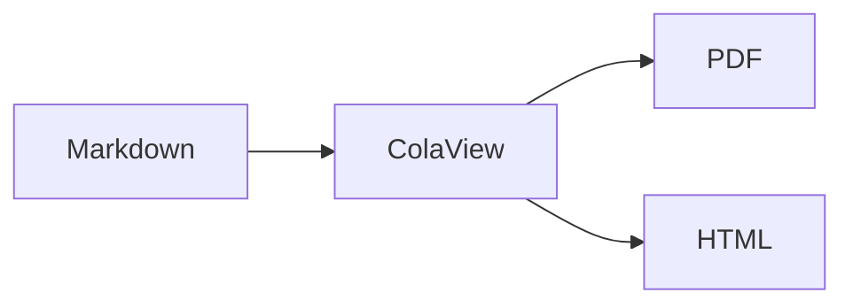

# ColaView MD

[](https://code.visualstudio.com/)
[](https://www.typescriptlang.org/)
[](LICENSE)
[](package.json)

Rich Markdown preview & PDF/HTML export for VS Code — powered by [ColaMD](https://github.com/byteuser1977/ColaMD-extend) rendering engine (Milkdown-based WYSIWYG).

## Features

- **WYSIWYG Preview** — Milkdown-powered read-only editor renders Markdown as rich text in real-time
- **Math Formulas** — KaTeX integration for inline `$...$` and display `$$...$$` expressions
- **Mermaid Diagrams** — 17+ chart types: flowcharts, sequence, class, state, ER, Gantt, mind maps, etc.
- **PDF Export** — Puppeteer headless Chrome renders A4 PDF with full theme styling
- **HTML Export** — Standalone `.html` with embedded CSS, zero-dependency sharing
- **4 Built-in Themes** — Light, Dark, Elegant, Newsprint + 2 custom themes (Academic Paper, Trae Blue)
- **Custom Theme Directory** — Drop `.css` files into `.themes/` folder in your workspace root; they appear automatically in the theme menu
- **Right-click Context Menu** — Export HTML/PDF, switch theme (with submenu), import custom theme — all from within the preview panel
- **Plugin Toggle** — Enable/disable math and mermaid rendering via settings, changes sync to preview in real-time
- **Live Sync** — 150ms debounced update while editing, experimental scroll sync between editor and preview

## Quick Start

1. Install the extension
2. Open a `.md` file in VS Code
3. `Ctrl+Shift+P` → **"ColaView MD: Show Preview"**
4. Preview opens in a side panel with rich rendering

## Commands & Usage

### Command Palette (`Ctrl+Shift+P`)

| Command | Description |
|---------|-------------|
| `ColaView MD: Show Preview` | Open or focus the preview panel |
| `ColaView MD: Export to PDF...` | Export current file as A4 PDF |
| `ColaView MD: Export to HTML...` | Export as standalone HTML |
| `ColaView MD: Switch Preview Theme...` | Choose from Light / Dark / Elegant / Newsprint |
| `ColaView MD: Import Custom Theme...` | Load a `.css` file as custom theme |

### Right-click Context Menu (in Preview)

When the preview is open, right-click anywhere to access:

| Menu Item | Description |
|-----------|-------------|
| **Export HTML** | Export current preview as standalone HTML |
| **Export PDF** | Export current preview as A4 PDF |
| **Theme ▸** | Submenu listing all built-in + custom themes (✓ marks active) |
| **Import Theme...** | Open file picker to import a `.css` file |

## Themes

### Built-in Themes

| Theme | Style | Best For |
|-------|-------|----------|
| **Light** | Clean white, blue accents | General use, documentation |
| **Dark** | GitHub Dark palette | Night coding |
| **Elegant** | Warm serif, beige tones | Academic papers, long-form |
| **Newsprint** | Serif, print texture | Print preparation |

### Custom Themes

Place `.css` files in the `.themes/` directory at your workspace root. Two custom themes are bundled with the extension:

| Theme | Style | Best For |
|-------|-------|----------|
| **Academic Paper** | GB/T 7713 standard, serif body, three-line tables, black-on-white | Academic papers, formal documents, printing |
| **Trae Blue** | Trae IDE documentation style, white + Slate gray, blue accents | Technical docs, modern documentation |

```
my-project/
├── .themes/
│   ├── my-dark.css        # appears as "My-dark" in theme menu
│   └── corporate.css      # appears as "Corporate" in theme menu
└── README.md
```

Custom themes are automatically detected and appear alongside built-in themes in both the command palette and right-click context menu.

Switch via command palette or settings:

```json
{ "colaview.theme": "dark" }
```

Import custom CSS: `Ctrl+Shift+P` → "ColaView MD: Import Custom Theme..." or via right-click menu → "Import Theme..."

## Configuration

| Setting | Type | Default | Description |
|---------|------|---------|-------------|
| `colaview.theme` | `string` | `"light"` | Preview theme: `light`, `dark`, `elegant`, `newsprint`, or any custom theme name |
| `colaview.plugins.math` | `boolean` | `true` | Enable KaTeX math rendering |
| `colaview.plugins.mermaid` | `boolean` | `true` | Enable Mermaid diagram rendering |
| `colaview.pdfMethod` | `string` | `"puppeteer"` | PDF engine: `puppeteer` or `webviewPrint` |
| `colaview.autoPreview` | `boolean` | `false` | Auto-open preview for `.md` files |
| `colaview.customThemesPath` | `string` | `""` | Directory for custom theme CSS files |
| `colaview.scrollSync` | `boolean` | `false` | **Experimental** — Enable scroll sync between editor and preview |

## Supported Syntax

**Standard Markdown** — Headings, bold, italic, strikethrough, code blocks, links, images, lists, blockquotes

**GFM Extensions** — Tables, task lists, footnotes, autolinks

**Math (KaTeX)**

```markdown
Inline: $E = mc^2$

Display:
$$\int_{-\infty}^{\infty} e^{-x^2} dx = \sqrt{\pi}$$
```

**Diagrams (Mermaid)**

````markdown

````

Supports: flowchart, sequence, class, state, ER, journey, pie, Gantt, gitGraph, mindmap, timeline, quadrant, XY, C4, Sankey, block, architecture

## Architecture

```
┌─────────────┐     postMessage      ┌──────────────────┐
│  Extension   │ ◄──────────────────► │    WebView        │
│  (Node.js)   │                      │  (Milkdown/       │
│              │   raw markdown ──►   │   ColaMD editor)  │
│  ThemeManager│   theme/css ──►      │                   │
│  Exporters   │   ◄── rendered HTML  │  Read-only WYSIWYG│
│              │                      │  + Context Menu   │
└─────────────┘                      └──────────────────┘
```

**Key design:** The extension sends raw Markdown to the WebView, where Milkdown (via ColaMD) renders it as a read-only WYSIWYG editor. For exports, the WebView returns the rendered HTML back to the extension. The WebView also hosts a right-click context menu for quick access to export and theme functions.

### Security Model

The WebView uses a strict Content-Security-Policy (CSP) with nonce-based script loading:

1. Extension generates a random `nonce` value per panel creation
2. CSP allows only scripts matching that specific `nonce`
3. All resource URIs are resolved through `webview.asWebviewUri()` for sandbox isolation
4. This prevents XSS injection even if markdown content contains malicious scripts

### Project Structure

```
src/
├── extension.ts              # Entry point (activate/deactivate), error isolation
├── commands/commands.ts      # Command registration (showPreview, exportHTML, exportPDF, etc.)
├── preview/
│   ├── preview-manager.ts    # WebView lifecycle, nonce CSP, message handling, debounce sync
│   └── webview/
│       ├── index.html        # WebView template + context menu styles
│       └── app.ts            # Milkdown/ColaMD init + context menu logic
├── export/
│   ├── pdf-exporter.ts       # Puppeteer PDF generation (A4, print background)
│   ├── html-exporter.ts      # Standalone HTML export (embedded CSS)
│   └── css-collector.ts      # CSS variable extraction for export documents
├── themes/
│   ├── theme-manager.ts      # Theme loading, switching, .themes/ directory scanning, import
│   ├── foundation.css        # Base CSS variables (colors, spacing)
│   └── built-in/             # light.css, dark.css, elegant.css, newsprint.css
└── types.ts                  # Shared type definitions
```

## Development

```bash
git clone https://github.com/bytechain/vscode-colaview.git
cd vscode-colaview
npm install

# Build (esbuild bundles all deps into out/)
npm run compile

# Watch mode
npm run watch

# Package .vsix (~206KB, no node_modules needed)
npm run package

# Debug: press F5 in VS Code to launch Extension Development Host
```

### Build System

The project uses **esbuild** for bundling — all dependencies (including `@bytechain.cn/colamd`, `katex`, `mermaid`, `puppeteer`) are inlined into `out/extension.js`. Resource files (CSS, WebView HTML/JS) are copied to `out/` during build. The resulting VSIX is ~206KB with zero external dependencies.

## Changelog

### v0.2.0 (Current)

- **🏗️ Architecture Overhaul** — Error-isolated activation, refactored PreviewManager, runtime plugin toggle sync for math/mermaid settings
- **🖱️ Right-Click Context Menu** — Export HTML/PDF, switch theme (with submenu), import custom theme — directly in the preview panel
- **🎨 New Custom Themes** — Academic Paper (GB/T 7713 standard) and Trae Blue (Trae IDE documentation style)
- **🧹 Cleanup** — Removed obsolete files (`debug-load.js`, `configuration.ts`, `file-utils.ts`)
- **🐛 Fixes** — h4 color consistency, code block border color, print margin width

### v0.1.3

- **🔄 Experimental Scroll Sync** — Bidirectional scroll synchronization between editor and preview panel. Enable via `colaview.scrollSync` setting.
- Enhanced error handling in extension activation and preview manager initialization

### v0.1.2

- **🐛 Blockquote Background Fix** — Fixed blockquote background color being overridden by page background in Dark, Light, and Newsprint themes

### v0.1.1

- **🎨 Theme Consistency Fix** — Unified `--code-color` and `--code-block-text` CSS variables across all 4 built-in themes (Light, Dark, Elegant, Newsprint), eliminating inconsistent inline code / code block text colors
- **📰 Newsprint Theme Alignment** — Fully aligned Newsprint theme variables with [ColaMD-extend](https://github.com/byteuser1977/ColaMD-extend) base.css, including font family (PT Serif serif stack), code color inheritance, and all semantic color tokens
- **🔧 Light Theme Completion** — Added missing `--table-border` variable to Light theme for consistent table styling
- **📦 Dependency Migration** — Switched from local ColaMD project reference to npm package `@bytechain.cn/colamd` (^1.5.2)

### v0.1.0

- Initial release with WYSIWYG preview, PDF/HTML export, 4 built-in themes, custom theme support

## License

[MIT](LICENSE)
