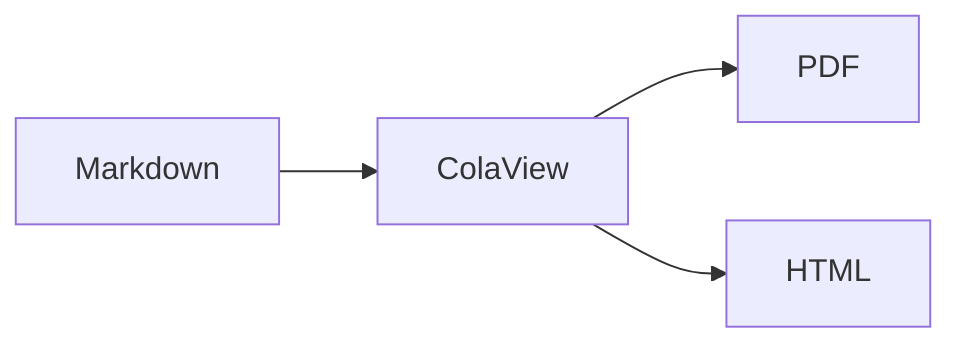

# ColaView MD

[](https://code.visualstudio.com/)
[](https://www.typescriptlang.org/)
[](LICENSE)
[](package.json)

VS Code 富文本 Markdown 预览与 PDF/HTML 导出扩展 — 基于 [ColaMD](https://github.com/byteuser1977/ColaMD-extend) 渲染引擎（Milkdown 所见即所得）。

## 功能特性

- **所见即所得预览** — 基于 Milkdown 的只读编辑器，实时渲染 Markdown 富文本
- **数学公式** — KaTeX 集成，支持行内 `$...$` 和块级 `$$...$$` 公式
- **Mermaid 图表** — 17+ 种图表：流程图、时序图、类图、状态图、ER 图、甘特图、思维导图等
- **PDF 导出** — Puppeteer 无头 Chrome 生成 A4 PDF，完整保留主题样式
- **HTML 导出** — 独立 `.html` 文件，内嵌 CSS，零依赖分享
- **4 套内置主题** — Light、Dark、Elegant、Newsprint + 自定义 CSS 导入
- **自定义主题目录** — 在工作区根目录 `.themes/` 文件夹中放入 `.css` 文件即可自动识别
- **右键上下文菜单** — 预览面板内直接导出 HTML/PDF、切换主题（含子菜单）、导入自定义主题
- **插件开关** — 通过设置在运行时动态启用/禁用数学公式和 Mermaid 渲染
- **实时同步** — 编辑后 150ms 防抖更新

## 快速开始

1. 安装扩展
2. 在 VS Code 中打开 `.md` 文件
3. `Ctrl+Shift+P` → **"ColaView MD: Show Preview"**
4. 侧边栏打开富文本预览

## 命令与使用方式

### 命令面板 (`Ctrl+Shift+P`)

| 命令 | 说明 |
|------|------|
| `ColaView MD: Show Preview` | 打开或聚焦预览面板 |
| `ColaView MD: Export to PDF...` | 导出为 A4 PDF |
| `ColaView MD: Export to HTML...` | 导出为独立 HTML |
| `ColaView MD: Switch Preview Theme...` | 切换主题：Light / Dark / Elegant / Newsprint |
| `ColaView MD: Import Custom Theme...` | 导入 `.css` 自定义主题 |

### 右键上下文菜单（预览面板内）

预览面板打开后，任意位置右键可访问：

| 菜单项 | 说明 |
|--------|------|
| **Export HTML** | 将当前预览导出为独立 HTML |
| **Export PDF** | 将当前预览导出为 A4 PDF |
| **Theme ▸** | 子菜单列出所有内置 + 自定义主题（✓ 标记当前激活） |
| **Import Theme...** | 打开文件选择器导入 `.css` 文件 |

## 主题

### 内置主题

| 主题 | 风格 | 适用场景 |
|------|------|----------|
| **Light** | 干净白底，蓝色调 | 通用、文档 |
| **Dark** | GitHub Dark 配色 | 夜间编程 |
| **Elegant** | 暖色衬线，米色基调 | 学术论文、长文 |
| **Newsprint** | 衬线排版，印刷质感 | 打印、正式文档 |

### 自定义主题

在工作区根目录的 `.themes/` 目录下放置 `.css` 文件：

```
my-project/
├── .themes/
│   ├── my-dark.css        # 在主题菜单中显示为 "My-dark"
│   └── corporate.css      # 在主题菜单中显示为 "Corporate"
└── README.md
```

自定义主题会被自动检测，与内置主题一起出现在命令面板和右键菜单的主题列表中。

通过命令面板或设置切换：

```json
{ "colaview.theme": "dark" }
```

导入自定义 CSS：`Ctrl+Shift+P` → "ColaView MD: Import Custom Theme..." 或右键菜单 → "Import Theme..."

## 配置项

| 配置 | 类型 | 默认值 | 说明 |
|------|------|--------|------|
| `colaview.theme` | `string` | `"light"` | 预览主题：`light`、`dark`、`elegant`、`newsprint` 或任意自定义主题名 |
| `colaview.plugins.math` | `boolean` | `true` | 启用 KaTeX 数学公式渲染 |
| `colaview.plugins.mermaid` | `boolean` | `true` | 启用 Mermaid 图表渲染 |
| `colaview.pdfMethod` | `string` | `"puppeteer"` | PDF 引擎：`puppeteer` 或 `webviewPrint` |
| `colaview.autoPreview` | `boolean` | `false` | 打开 `.md` 文件时自动显示预览 |
| `colaview.customThemesPath` | `string` | `""` | 自定义主题 CSS 目录路径 |

## 支持的语法

**标准 Markdown** — 标题、粗体、斜体、删除线、代码块、链接、图片、列表、引用

**GFM 扩展** — 表格、任务列表、脚注、自动链接

**数学公式（KaTeX）**

```markdown
行内：$E = mc^2$

块级：
$$\int_{-\infty}^{\infty} e^{-x^2} dx = \sqrt{\pi}$$
```

**图表（Mermaid）**

````markdown

````

支持：流程图、时序图、类图、状态图、ER 图、用户旅程、饼图、甘特图、Git 图、思维导图、时间线、四象限图、XY 图、C4 架构图、Sankey 图、Block 图、架构图

## 技术架构

```
┌─────────────┐     postMessage      ┌──────────────────┐
│  Extension   │ ◄──────────────────► │    WebView        │
│  (Node.js)   │                      │  (Milkdown/       │
│              │   raw markdown ──►   │   ColaMD editor)  │
│  ThemeManager│   theme/css ──►      │                   │
│  Exporters   │   ◄── rendered HTML  │  只读 WYSIWYG     │
│              │                      │  + 右键上下文菜单  │
└─────────────┘                      └──────────────────┘
```

**核心设计：** 扩展端将原始 Markdown 发送到 WebView，由 Milkdown（通过 ColaMD）渲染为只读所见即所得编辑器。导出时，WebView 将渲染后的 HTML 返回给扩展端。WebView 同时承载右键上下文菜单，提供快捷的导出和主题操作入口。

### 安全模型

WebView 采用严格的内容安全策略（CSP），配合 nonce 机制加载脚本：

1. 扩展每次创建面板时生成随机 `nonce` 值
2. CSP 仅允许匹配该特定 `nonce` 的脚本执行
3. 所有资源 URI 通过 `webview.asWebviewUri()` 解析，实现沙箱隔离
4. 即使 Markdown 内容包含恶意脚本也能防止 XSS 注入

### 项目结构

```
src/
├── extension.ts              # 入口（activate/deactivate），错误隔离
├── commands/commands.ts      # 命令注册（showPreview, exportHTML, exportPDF 等）
├── preview/
│   ├── preview-manager.ts    # WebView 生命周期、nonce CSP、消息处理、防抖同步
│   └── webview/
│       ├── index.html        # WebView 模板 + 右键菜单样式
│       └── app.ts            # Milkdown/ColaMD 初始化 + 右键菜单逻辑
├── export/
│   ├── pdf-exporter.ts       # Puppeteer PDF 生成（A4、保留背景）
│   ├── html-exporter.ts      # 独立 HTML 导出（内嵌 CSS）
│   └── css-collector.ts      # CSS 变量提取（用于导出文档）
├── themes/
│   ├── theme-manager.ts      # 主题加载、切换、.themes/ 目录扫描、导入
│   ├── foundation.css        # 基础 CSS 变量层（颜色、间距）
│   └── built-in/             # light.css, dark.css, elegant.css, newsprint.css
├── config/configuration.ts   # 设置默认值
└── utils/file-utils.ts       # 文件 I/O 工具
```

## 开发

```bash
git clone https://github.com/bytechain/vscode-colaview.git
cd vscode-colaview
npm install

# 构建（esbuild 将所有依赖打包到 out/）
npm run compile

# 监听模式
npm run watch

# 打包 .vsix（约 206KB，无需 node_modules）
npm run package

# 调试：在 VS Code 中按 F5 启动扩展开发宿主
```

### 构建系统

项目使用 **esbuild** 打包 — 所有依赖（包括 `@bytechain.cn/colamd`、`katex`、`mermaid`、`puppeteer`）均内联到 `out/extension.js`。构建时自动复制资源文件（CSS、WebView HTML/JS）到 `out/` 目录。最终 VSIX 约 206KB，零外部依赖。

## 更新日志

### v0.1.1

- **🎨 主题一致性修复** — 统一 4 套内置主题（Light、Dark、Elegant、Newsprint）的 `--code-color` 和 `--code-block-text` CSS 变量，解决行内代码与代码块字体颜色不一致的问题
- **📰 Newsprint 主题对齐** — Newsprint 主题变量完全对齐 [ColaMD-extend](https://github.com/byteuser1977/ColaMD-extend) base.css，包括衬线字体（PT Serif 字体栈）、代码颜色继承及全部语义化颜色 token
- **🔧 Light 主题补全** — 补充 Light 主题缺失的 `--table-border` 变量，确保表格样式一致
- **📦 依赖迁移** — 从本地 ColaMD 项目引用切换为 npm 包 `@bytechain.cn/colamd` (^1.5.2)

### v0.1.0

- 首次发布，包含所见即所得预览、PDF/HTML 导出、4 套内置主题、自定义主题支持

## 许可证

[MIT](LICENSE)
